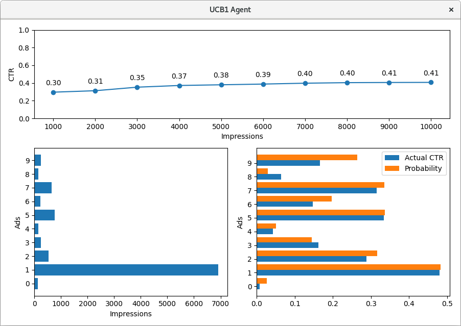

[](https://travis-ci.com/falox/gym-adserver)
[](https://codecov.io/gh/falox/gym-adserver)
[](https://pypi.python.org/pypi/gym-adserver/)

# gym-adserver

`gym-adserver` is an [OpenAI Gym](https://github.com/openai/gym) environment for reinforcement learning-based online advertising algorithms.

`gym-adserver` is now one of the [official OpenAI environments](https://github.com/openai/gym/blob/master/docs/environments.md).

The `AdServer` environment implements a typical [multi-armed bandit scenario](https://en.wikipedia.org/wiki/Multi-armed_bandit) where an [ad server](https://en.wikipedia.org/wiki/Ad_serving) agent must select the best advertisement (ad) to be displayed in a web page.

Each time an ad is selected, it is counted as one [impression](https://en.wikipedia.org/wiki/Impression_(online_media)). A displayed ad can be clicked (reward = `1`) or not (reward = `0`), depending on the interest of the user The agent must maximize the overall [click-through rate](https://en.wikipedia.org/wiki/Click-through_rate).

### OpenAI Environment Attributes

| Attribute | Value | Notes
|--|--|--|
| Action Space | Discrete(n) |  n is the number of ads to choose from
| Observation Space| Box(0, +inf, (2, n)) | Number of impressions and clicks for each ad
| Actions | [0...n] | Index of the selected ad
| Rewards | 0, 1 | 1 = clicked, 0 = not clicked
| Render Modes | 'human' | Displays the agent's performance graphically

## Installation

You can download the source code and install the dependencies with:

```bash
git clone https://github.com/falox/gym-adserver
cd gym-adserver
pip install -e .
```

Alternatively, you can install `gym-adserver` as a [pip package](https://pypi.org/project/gym-adserver/):

```bash
pip install gym-adserver
```

## Basic Usage

You can test the environment by running one of the built-in agents:

```bash
python gym_adserver/agents/ucb1_agent.py --num_ads 10 --impressions 10000
```

The environent will generate 10 (`num_ads`) ads with different performance rates and the agent, without prior knowledge, will learn to select the most performant ones. The simulation will last 10000 iterations (`impressions`).

A window will open and show the agent's performance and the environment's state:



The overall CTR increases over time as the agent learns what the best actions are.

During the initialization, the environment assigns to each ad a "Probability" to be clicked. Such a probability is known by the environment only and will be used to draw the rewards during the simulation. The "Actual CTR" is the CTR actually occurred during the simulation: with time, it approximates the probability.

The effective agent will give most impressions to the most performant ads.

## Built-in Agents

The _gym_adserver/agents_ directory contains a collection of agents implementing the following strategies:

- Random
- [epsilon-Greedy](https://en.wikipedia.org/wiki/Multi-armed_bandit#Semi-uniform_strategies)
- [Softmax](https://en.wikipedia.org/wiki/Softmax_function#Reinforcement_learning)
- [UCB1](https://en.wikipedia.org/wiki/Monte_Carlo_tree_search#Exploration_and_exploitation)

Each agent has different parameters to adjust and optimize its performance.

You can use the built-in agents as a starting point to implement your own algorithm.

## Unit Tests

You can run the unit test for the environment with:

```bash
pytest -v
```

## Next Steps

- Extend AdServer with the concepts of _budget_ and _bid_
- Extend AdServer to change the ad performance over time (currently the CTR is constant)
- Implement [Q-learning](https://en.wikipedia.org/wiki/Q-learning) [agents](https://medium.com/swlh/introduction-to-q-learning-with-openai-gym-2d794da10f3d)
- Implement a meta-agent that exploits multiple sub-agents with different algorithms
- Implement epsilon-Greedy variants
- Implement an environment/wrapper to run and compare multiple agents
